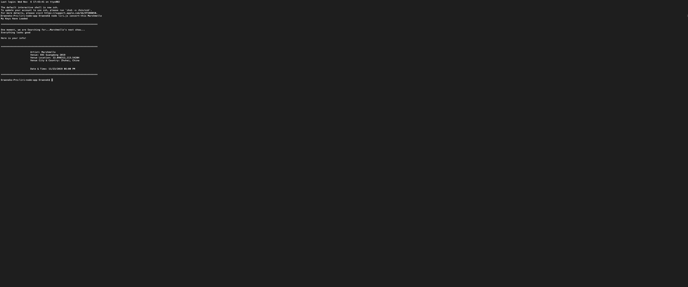
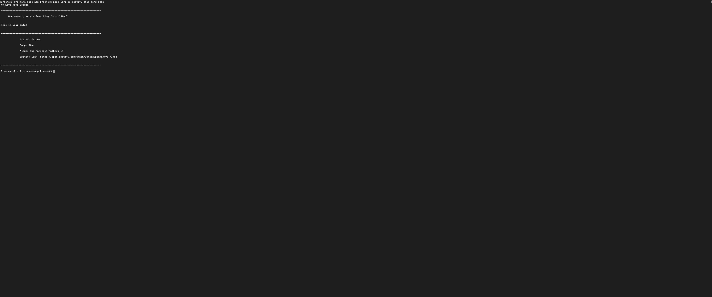

<h1 align="center">My-Bamazon CLI</h1>
Welcome to my Bamazon a node.js "cli" application for a storefront that can hold inventory/stock and take orders based on user requests using their command line.

<h1>NPM Packages & Technology used</h1>
:point_right: <a href=https://www.npmjs.com/package/npm>NPM install</a>
 
:point_right: <a href=https://www.npmjs.com/package/dotenv>NPM install dotenv</a>
 
:point_right: <a href=https://www.npmjs.com/package/request>NPM install request</a>
 
:point_right: <a href=https://www.npmjs.com/package/moment>NPM install moment</a>
 
:point_right: <a href=https://www.npmjs.com/package/axios>NPM install axios</a>
 
:point_right: <a href=https://www.npmjs.com/package/fs>NPM install fs</a>
 
:point_right: <a href=https://www.npmjs.com/package/node-spotify-api>NPM install node-spotify-api</a>
 

<h3>Terminal</h3>

<h3>Visual Code</h3>

<h3>NPM</h3>

<h3>Node.js</h3>

<h1>Scripts/Files used</h1>
1. The first thing the user must do is type node in the terminal to init node.
2. Install required packages listed above.
3. Then type one of our three commands (concert-this, spotify-this-song, or movie-this)!
4. The info is delivered to you!

Here is what it looks like from a glance
image 1 shows the bands in town api being called

image 2 shows the spotify api being called

<h2>.txt file export option in the works!!!</h2>
